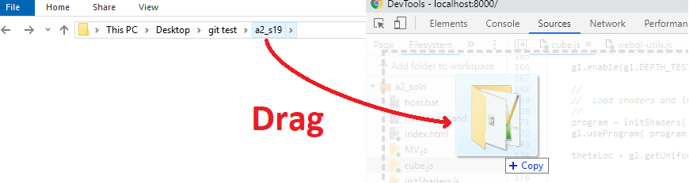
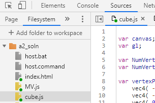
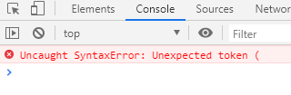
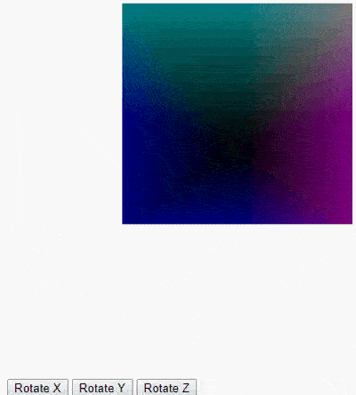
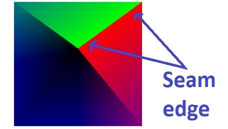
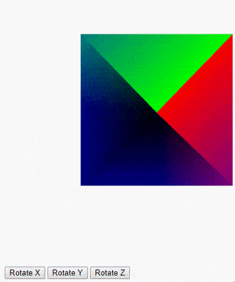
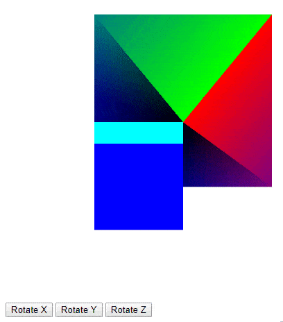

# Assignment #2

# Making your own Geometry; Exploring WebGL calls in Code

The files here will animate the spinning cube example from chapter four of your textbook.  Only get the files from here, not your textbook's site, because we've modified them to make them easier to explain.

Like the previous assignment, this one will be quick, illustrative, and pretty limited in scope; you'll merely edit some lists of points and colors again.  This time, you're paying more attention to designing something. 

You're also paying a whole lot more attention to the surrounding program.  If you do the extra credit, you'll get an impression of what WebGL programming is like for most people, which can be rather tedious.  Each change to your scene (such as creating a new shape) involves carefully editing code in several places instead of just one.  The next assignment will provide a nicer way than this.

For now it's a good idea to read chapter 2 of your textbook to get an idea for what parts the author's WebGL programs are made of (shaders, buffers, etc.).

Make sure you are looking at the *newest* edition of the textbook (7th).  Especially double check if you got one of the two choices off of Piazza.  You might need to go back there and get it again.

  

## Step 1:  Begin with repository setup:

1. By now you have followed a link to create this assignment repository, which must look like **a2-githubusername**.  Don't generate it more than once.

2. Copy this repository to your computer as you did last time.  Find the big green button on the page that says "Clone or download", and either activate GitHub Desktop or just download it as a .zip (if you're planning to go without GitHub's tools).

## Step 2:  Test run your project.  

1. Go to your folder.

  	
 
2.  Click open "host.bat" or "host.command" to run the host as you did before.

3.  Open a new browser window to "localhost:8000".

4.  You should see a spinning cube animation.  If not, check the error console and ask on Piazza.

  	

## Step 3:  Enable editing

1.  Press F12 (Windows) or Cmd+Option+i (Mac) to open the Chrome developer tools panel (DevTools).

2.  Re-do all the step from assignment 1 that gives Chrome permission to edit your folder.  It's not the same folder as you used for assignment 1, so you'll need to drag your assignment 2 folder into the coding area and then tell Chrome "allow" when it asks for permissions for it.

  	
    
    
  	

3.  You should now see green dots next to the file "index.html" as well as the four ".js" files.  

  Note:  If not, repeat assignment 1 stuff until it works, or even remove your old (assignment 1) folder from the list of workspaces if necessary. Under the "filesystem" tab under Sources, right click your old folder and say "Remove folder from workspace".   Then, drag your assignment 2 folder into the coding area instead so that it maps correctly.

4.  Open "cube.js" under the Sources tab.  This is the file you'll be editing.  It is loaded by index.html, the only other file that contains code particular to this drawing.
  
  	
  
5.  Test that editing the code of "cube.js" works.  Delete a "{" or something important somewhere in the source code and refresh the page with ctrl+F5 (Windows) or cmd+F5 (Mac).  Verify that the animation has stopped working.  An error will show in the console too.  If so, editing works and you can do the assignment.  If not, keep messing with the above steps.

  	
    
Remember to fix your error.
  
## Step 4: Edit the code (graded part)

### Part 1:  Build a geometric shape.

(15 points)

Let's build a different shape than the cube, using a vertex array without indexing (soon we'll explore indexing too).

Near the top of "cube.js" there is a variable called vertexPositions.  It's a JavaScript array that fills itself with vectors (using the vec4 function, which returns a JavaScript array of four float numbers for homogeneous coordinates) to describe where the points of the cube are.  A cube has 8 corners.  Here, there are 36 points instead of just 8, because a lot of repetition is going on.  The points are listed in order of how triangles should connect them, so every three points is one triangle.  Each cube corner gets touched by several triangles (hence the repetition).

Also notice the variable right below, called vertexColors.  It assigns a single color to each cube face.  The same color has to be repeated six times, because each face is made of two triangles of three points each.

Follow these steps to correctly show a different shape (a certain four sided pyramid).  We will check for this pyramid when we load your page.

1.  Delete all the cube faces except for the rear one (z = 0.5).  This leaves just a square.  Produce a four sided pyramid instead.  Add four new triangles that connect each side of this remaining square to the origin point ( x = 0, y = 0, z = 0 ).  If you have to, draw it out on paper and label points and triangles to get it right.

2.  Update the variable NumVertices to match what you changed.

3.  Overwrite the variable vertexColors to have the same list of vec4 values as vertexPositions has.  This will set all the colors to values that directly come from spatial position values.  X coordinate will affect red intensity, Y affects green, Z affects blue.

4.  Reload the page.  You should see this:

  	
  
Notice that the colors on your pyramid are not solid across each face, like they were for the cube.  Instead the colors fade towards each point.  That's because we use multiple colors per each triangle. The cube just repeated the same color three times to make each triangle, but your pyramid doesn't.  When multiple different conflicting data values (like color) exist in a triangle, it's going to fill itself in by fading between those values like you see.  It uses interpolation in barycentric coordinates to do this.  In the next step will gain more control over this effect.

### Part 2:  Work on the shape more:  Create a visible seam along an edge.

(15 points)

Change the color of the top right edge of the pyramid (as shown before the animation spins around at all).  Do it in a way that produces a visible seam from green to red along the edge.

  

This means you'll have to overwrite some of the colors in your array that were previously just set to the same thing wherever the pyramid touches the same point in space.  This time, we'll have to set colors to different values even as the same coordinate position is touched.

Suppose the top right edge's points are called A and B.  Because we're defining each triangle's point lists separately, that means the edge from A to B and the edge from B to A actually have nothing in common; they're parts of two different triangles.  It's really more like one edge (of the top triangle) goes from A to B, and the other edge (of the right triangle) from C to D, and points A and D just happen to overlap in the same spot in 3D space but they don't know about each other; likewise for B and C overlapping.

Find the correct colors in your vertexColors array to change to red or green to overwrite the colors for A, B, C, and D as shown in the picture.

  
  
What you have done is prepared an edge of this shape for "flat shading".  Flat shading produces sharp, crisp visible seams on geometry.  It is often done by making data values (like color) differ across the seam as you approach the same point from different sides (different triangle faces).  Here we are providing points (vertices) to our data structure that have identical positions but different color.

Flat shading can be an inherent property of how a shape is defined, just by setting up the triangles to not necessarily alias to the same data values when points overlap.  We'll need this later for making shapes appear to have sharp edges when lighting.  Then we'll need it again when we want to wrap images (textures) around our shapes, wherever we want the image file to have a seam (such as where another image should meet it at an edge without any smearing).

### Part 3 (Extra credit):

(20 bonus points)

Modify your program to draw two different shapes at once.

1.  Create arrays for your second shape.  It must be:
  - Different from the pyramid
  - Fully contained within in the (-x, -y, -z) quadrant; no positive numbers.

 The easiest way to do this is to paste in the original cube again, under different array names, and then find and replace " 0.5" (including the space) with " 0.0".  Or you could make some other shape, as long as it's within those bounds.  This helps our graders by making sure your pyramid and its seam are still visible on startup.

Refer to chapter 2 of your textbook if the next parts get confusing.
 
2.  Alter the window.onload() and render() functions to draw both shapes together.  These functions contain many WebGL calls (any calls to the variable called "gl").  Tips for how to do this follow.

3.  You will need:
- Another NumVertices variable
- Another few WebGL lines for setting up a second vertex buffer
- Another few WebGL lines for setting up a second color buffer

3.  You are NOT allowed to call gl.bufferData() from your render() function.  That would run too often, sending duplicate information (shape blueprints) to the GPU every time an animation frame draws, and slowing your program down.  

Instead, save the buffer variables from window.onload() by moving their declaration to the outermost scope.

4.  In render(), you will need:
- A second WebGL call to gl.drawArrays(), making sure to pass in an appropriate number of vertices*
- Before each of those calls, another few WebGL lines to set the "attribute pointer", once for position and again for color
- Before each of THOSE calls, another WebGL call to select the correct buffer - position or color - of the right shape you intend to draw.  These are the variables you moved to the outer scope before.
 
*Passing in an incorrect number of vertices is either an unrecoverable error that draws nothing (if too big) or results in only part of your shape being drawn (if too small).

You had to edit a lot of places in the file to add a second shape, but now it should hopefully show up near the pyramid. 

  
  
Conclusion: Now you know what WebGL programmers generally have to deal with:  Lots of steps for each change.  Relatedly, if you were to color in your second shape with a different shader program, that would also require editing your code in even more places, including the textbook's initShaders.js and index.html files.  Fortunately, a lot of the repetitiveness of WebGL can be factored away into re-usable functions, as we will see soon.
   
## Step 5:  Continue the next steps to turn in assignment 2 on CCLE:

1.  Zip up all your files (except for the "docs" folder or .git folder, please leave them out) in a single .zip file, which you will name after your student UID.  Turn in your .zip on CCLE, where we will add a place to do so.

2.  Again, please leave out your docs folder.  It is too big.  Also leave out your .git folder.  It is huge.

3.  You can push your changes to GitHub too if you want.  Or you can just keep your repo copy local to your machine.  Either way, it can be helpful to commit your code to your repo whenever it works, so you can always go back to that state using GitHub desktop's buttons, or easily see what changes you've made since then.